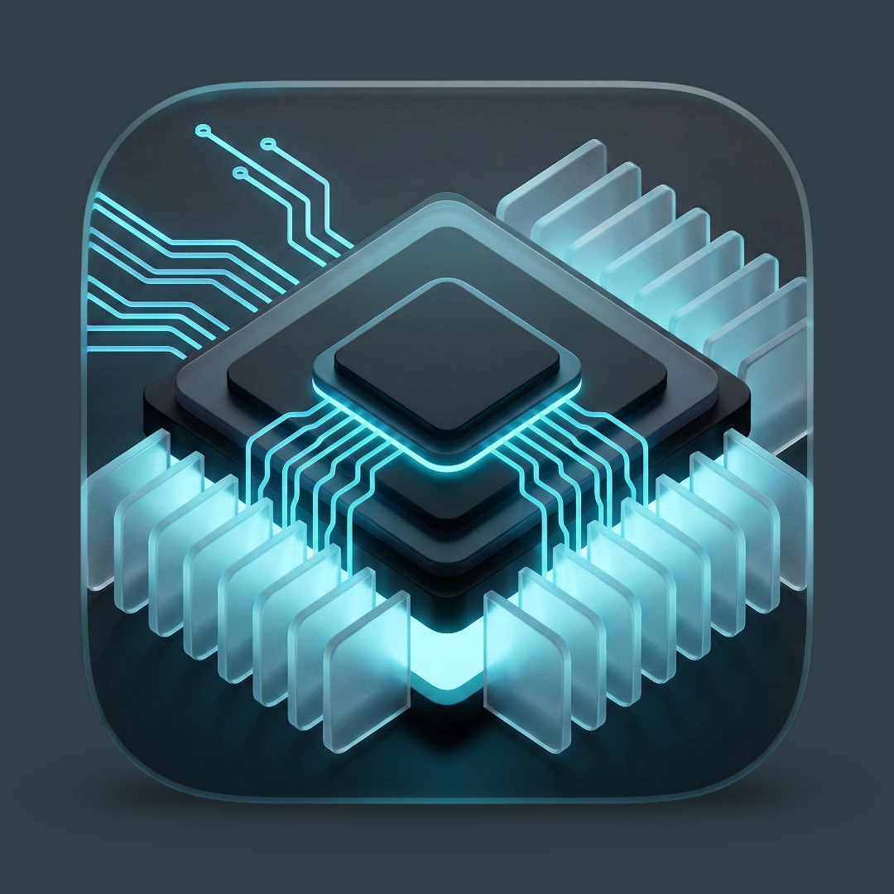

# MakeWindowsGreatAgain

**An open-source Windows optimization toolkit focused on performance, privacy, and control.**

[Download v1.1](https://github.com/aravindpartheeban/MakeWindowsGreatAgain/releases/latest)
•
[View Source](https://github.com/aravindpartheeban/MakeWindowsGreatAgain/blob/main/src/MakeWindowsGreatAgain.ps1)

---

## Overview

MakeWindowsGreatAgain is a Windows utility designed to remove unnecessary bloat, reduce background activity, apply system-level tweaks, and give users greater control over how Windows behaves.

The project is fully **open source**.  
Both the **PowerShell script** and the **compiled executable** are provided.

---

## Features

- **Dashboard**  
  System overview (CPU, GPU, RAM, Disk, OS) with quick access to sections.

- **Install Apps**  
  One-click installs using Winget. Curated apps across browsers, utilities, dev tools, media, and gaming.

- **Tweaks**  
  Performance and UI optimizations with measurable impact.  
  Includes **dry-run mode** to preview changes before applying.

- **Privacy**  
  Disable telemetry, ads, tracking IDs, and unnecessary background services.  
  Also supports **dry-run preview**.

- **Debloat**  
  Remove preinstalled Microsoft apps and optional components you don’t use.

- **Network**  
  DNS configuration and basic network repair tools.

---

## Requirements

- Windows 11
- Windows 10 (1903+) - not all features supported
- Administrator privileges recommended

This project is built with Windows 11 in mind.
Certain features may not work on Windows 10 and are not actively
maintained for compatibility.

---

## Changelog

### v1.1
- Added dry-run mode for Tweaks and Privacy
- Minor bug fixes and stability improvements
- General UI and performance refinements

---

## Notes

- ⚠️ Create a restore point before applying advanced tweaks  
- 🔄 Some changes may require a restart or sign-out  
- 📝 Actions are logged to `log.txt`

---

Provided as-is. No warranty implied.

